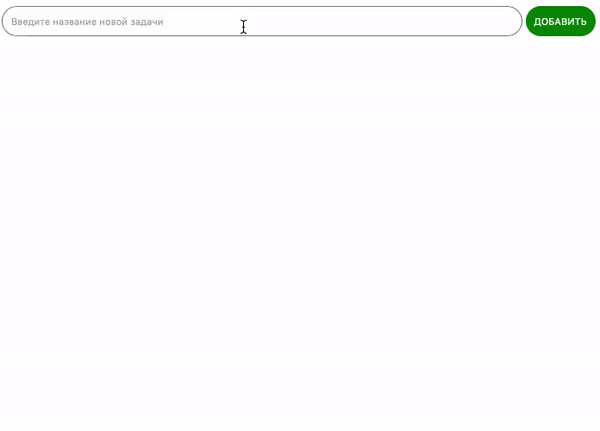
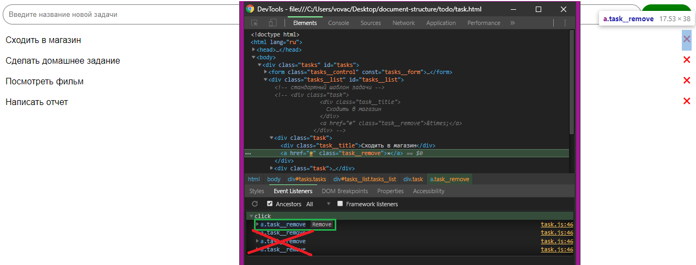

# Простой список дел

Домашнее задание к занятию 2.3 «Изменение структуры HTML-документа».

## Описание 

Необходимо написать простой планировщик дел. В данной версии все дела
теряются после обновления страницы



### Исходные данные

1. Основная HTML-разметка
2. Базовая CSS-разметка

Шаблон новой задачи выглядит так:

```html
<div class="task">
  <div class="task__title">
    Сходить в магазин
  </div>
  <a href="#" class="task__remove">&times;</a>
</div>
```

При нажатии на элемент с классом *task__remove*, задача должна удаляться

### Процесс реализации

1. Реализуйте добавление задач по нажатию клавиши Enter при наличии текста
в поле ввода
2. Реализуйте механизм удаления задач
3. Важный момент: в задании для кнопок удаления задач для каждой кнопки должен быть только **один** обработчик события. Тоесть не должно быть более одного обработчика. Для этого добавляйте слушатель события **только** на добавляемый элемент.


### Повышенный уровень сложности (не обязательно)

Сделайте сохранение задач даже после перезагрузки страницы.

В будущих лекциях мы будем касаться локального хранилища (localStorage).
Для решения этой задачи, вам потребуется познакомиться с темой уже сейчас.