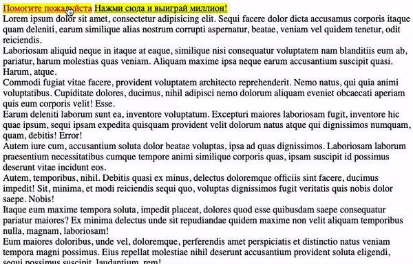

# Всплывающая подсказка

Домашнее задание к занятию 2.3 «Изменение структуры HTML-документа».

## Описание 

Необходимо написать всплывающую подсказку для элементов. Подсказка появляется
после клика на элементе.



### Исходные данные

1. Основная HTML-разметка
2. Базовая CSS-разметка

Базовая разметка элемента, который нуждается в подсказке:

```html
<a href="" class="has-tooltip" title="Что бы вы хотели?">Помогите пожалуйста</a>
```

Шаблон подсказки выглядит так:

```html
<div class="tooltip">Текст подсказки</div>
```

Данные для текста подсказки берутся из атрибута *title*

Подсказки активируются классом *tooltip_active*


### Процесс реализации

1. Реализуйте появление подсказки на основе положения текста
2. Показывайте подсказку при клике на элемент.